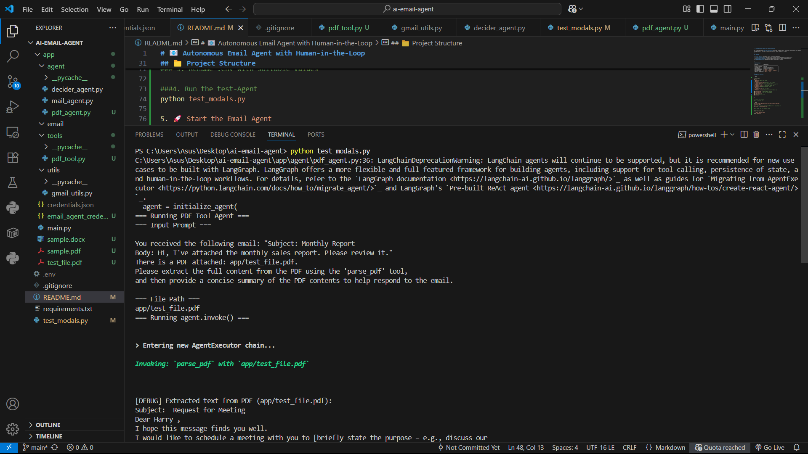
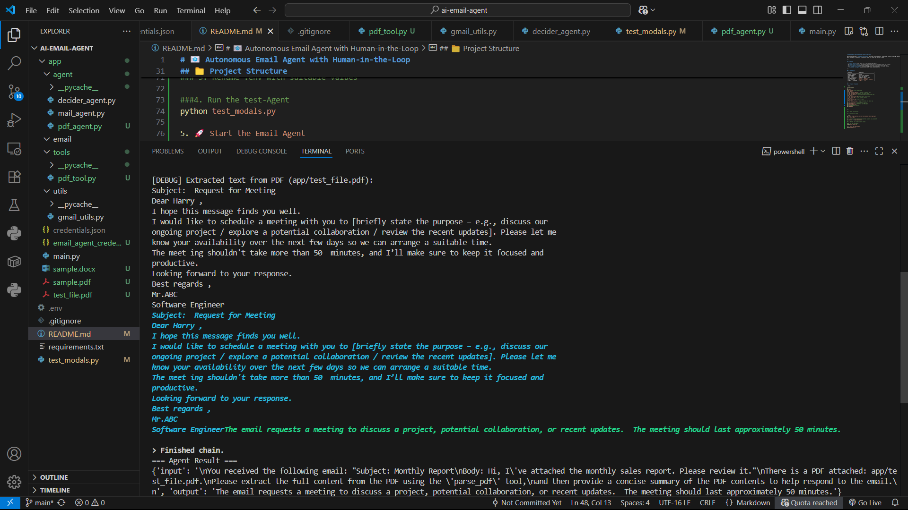
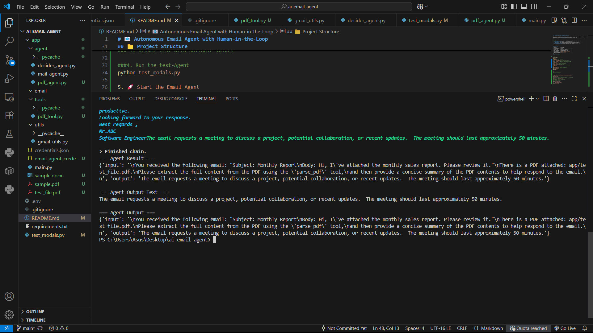

# 📧 Autonomous Email Agent with Human-in-the-Loop

This project builds an **AI email assistant** that reads incoming emails, understands context using LLMs (Gemini), and replies automatically where possible. In uncertain or sensitive cases, it routes the mail to a human.

---

 

## ✨ Features

- ✅ **Fetch Emails**: Uses Gmail API to retrieve unread emails.
- 🧠 **Understand Context**: Uses Gemini via LangChain to determine mail intent and urgency.
- ✍️ **Auto-Reply**: Drafts and sends responses to routine or straightforward queries.
- 👨‍💼 **Human-in-the-loop**: Escalates ambiguous or sensitive emails for manual review.
- ⏰ **Scheduled Polling**: Automatically checks inbox every X minutes.

---

## 🧱 Tech Stack

| Component            | Technology                      |
|---------------------|----------------------------------|
| Backend Framework    | main.py                          |
| Language Model       | Gemini (via LangChain)           |
| Email Access         | Gmail API (OAuth2)               |
| Agent Architecture   | LangChain Agents + Tools         |
| Config Management    | `dotenv`, `pydantic`             |
| Async Execution      | `httpx`, `aiohttp`, `schedule`   |
| Logging & Debugging  | `loguru`, `rich`                 |

---

## 📁 Project Structure

```bash

ai-email-agent/
│
├── app/
│ ├── main.py # Main loop runner
│ ├── agent/
│ │ ├── decider_agent.py # Decides if auto or HITL
│ │ ├── mail_agent.py # Drafts and sends reply
│ │ └── pdf_agent.py # Parses and summarizes attached PDFs
│ ├── email/
│ │ ├── gmail_client.py # Gmail auth, fetch, send
│ │ └── parser.py # Parses threads, bodies
│ ├── tools/
│ │ └── pdf_tool.py # Raw PDF reader
│ ├── utils/
│ │ └── gmail_utils.py # Helper functions for Gmail ops
│
├── app/sample.pdf # Sample PDF for testing
├── app/test_file.pdf # another PDF for testing
├── test_modals.py # Test file for PDF agent
├── requirements.txt
├── .env # Sample env file
└── README.md
└── .gitignore( contains .env,email_agent_credentials.json and  credentials.json )

```
## 📱 Screenshots


 

  

   
  

 


## ⚙️ Setup Instructions

### 1. ✅ Clone the Repo

```bash
git clone https://github.com/your-username/ai-email-agent.git
cd ai-email-agent

### 2. Install required dependencies.Make sure to use python3.9+
pip install -r requirements.txt

### 3. Rename .env with suitable values

###4. Run the test-Agent
python test_modals.py

5. 🚀 Start the Email Agent
python app/main.py
---
